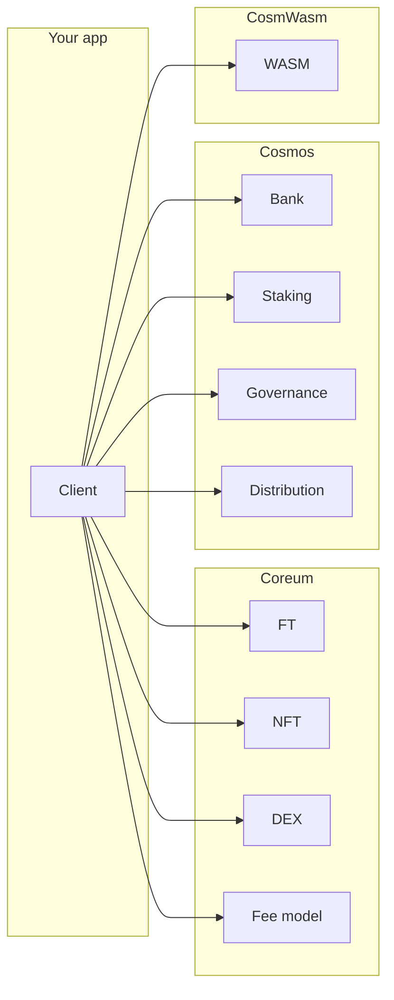

# TX JS/TS SDK

A JavaScript/TypeScript library for interacting with the **TX** blockchain. Built on [CosmJS](https://github.com/cosmos/cosmjs), it provides a typed client, message builders, query extensions, and wallet integrations for Coreum-native modules (FT, NFT, DEX) and standard Cosmos modules.

## Features

- **Unified Client** — Connect via RPC, sign and broadcast transactions, query chain state, and subscribe to events
- **Coreum modules** — Fungible Tokens (FT), NFTs, native DEX, and fee model with typed messages and query extensions
- **Cosmos modules** — Bank, Staking, Distribution, Governance, Authz, Feegrant, Vesting
- **CosmWasm** — Deploy and interact with smart contracts
- **Wallet support** — Keplr, Cosmostation, Leap, or mnemonic-based signing
- **Gas & fees** — Fee estimation, gas calculation, and fee model queries
- **Multisig** — Create multisig accounts and use custom signers
- **Amino types** — Coreum Amino type registration for Ledger and Amino-compatible wallets

## Installation

```bash
npm install @pulsara/tx-js
```

## Quick Start

### Connect (query-only)

```typescript
import { Client, CoreumNetwork } from "@pulsara/tx-js";

const client = new Client({ network: CoreumNetwork.TESTNET });
await client.connect();

// Query chain state (no signer required)
const balance = await client.queryClients?.bank.balance(
  "core1...",
  "utestcore"
);
```

### Connect with browser wallet (Keplr, Cosmostation, or Leap)

```typescript
import { Client, CoreumNetwork, ExtensionWallets } from "@pulsara/tx-js";

const client = new Client({ network: CoreumNetwork.TESTNET });
await client.connectWithExtension(ExtensionWallets.KEPLR);

console.log(client.address); // Connected wallet address
```

### Connect with mnemonic

```typescript
import { Client, CoreumNetwork } from "@pulsara/tx-js";

const client = new Client({ network: CoreumNetwork.TESTNET });
await client.connectWithMnemonic("your twelve or twenty four word mnemonic...");
```

### Send a transaction

```typescript
import { Client, Bank, CoreumNetwork } from "@pulsara/tx-js";

const client = new Client({ network: CoreumNetwork.TESTNET });
await client.connectWithMnemonic(process.env.MNEMONIC!);

const msg = Bank.Send({
  fromAddress: client.address!,
  toAddress: "core1...",
  amount: [{ denom: "utestcore", amount: "1000000" }],
});

const result = await client.sendTx([msg]);
console.log(result.transactionHash);
```

### Query FT token info

```typescript
const token = await client.queryClients?.ft.token("denom_issuer_subunit");
const balance = await client.queryClients?.ft.balance(
  "core1...",
  "denom_issuer_subunit"
);
```

## Network configuration

The SDK supports three networks out of the box:

| Network | Chain ID           | Bech32 prefix |
| ------- | ------------------ | ------------- |
| Mainnet | `coreum-mainnet-1` | `core`        |
| Testnet | `coreum-testnet-1` | `testcore`    |
| Devnet  | `coreum-devnet-1`  | `devcore`     |

Set the network in the client constructor:

```typescript
const client = new Client({ network: "mainnet" }); // or "testnet" | "devnet"
```

You can override RPC/WebSocket endpoints via `custom_node_endpoint` and `custom_ws_endpoint` when a network is specified. See [Network configuration](docs/network-config.md) for details.

## Architecture overview



- **Client** — Single entry point: connects to the chain, holds a signing client (when using wallet or mnemonic), and exposes `queryClients` with all query extensions (ft, nft, nftbeta, bank, gov, distribution, dex, staking, auth, mint, feegrant, ibc, wasm, tx).
- **Coreum** — FT (issue, mint, burn, freeze, whitelist, clawback, DEX settings), NFT (issue class, mint, send, freeze, whitelist), DEX (place/cancel orders), and fee model queries.
- **Cosmos** — Message builders and query extensions for Bank, Staking, Distribution, Governance, Authz, Feegrant, Vesting.
- **WASM** — CosmWasm transaction encoding and query extension for smart contracts.
- **Utils** — Wallet generation, address validation, unit conversion, feature parsers, and event parsing.

## Documentation

Detailed docs live in the `docs/` folder:

| Document                                 | Description                                                                   |
| ---------------------------------------- | ----------------------------------------------------------------------------- |
| [Client](docs/client.md)                 | Client class: connection, signing, broadcasting, queries, multisig, WebSocket |
| [Coreum FT](docs/coreum-ft.md)           | Fungible Token module — messages, queries, features                           |
| [Coreum NFT](docs/coreum-nft.md)         | NFT module — messages, queries, class features                                |
| [Coreum DEX](docs/coreum-dex.md)         | DEX module — orders, order books, queries                                     |
| [Cosmos modules](docs/cosmos-modules.md) | Bank, Staking, Distribution, Governance, Authz, Feegrant, Vesting             |
| [CosmWasm](docs/cosmwasm.md)             | Smart contract deployment and queries                                         |
| [Wallets](docs/wallets.md)               | Keplr, Cosmostation, Leap integration                                         |
| [Types](docs/types.md)                   | Enums, interfaces, and type reference                                         |
| [Utilities](docs/utilities.md)           | Calculations, wallet helpers, feature parsers, events                         |
| [Amino types](docs/amino-types.md)       | Amino type registration and usage                                             |
| [Network config](docs/network-config.md) | Network configuration and custom endpoints                                    |

## License

ISC
